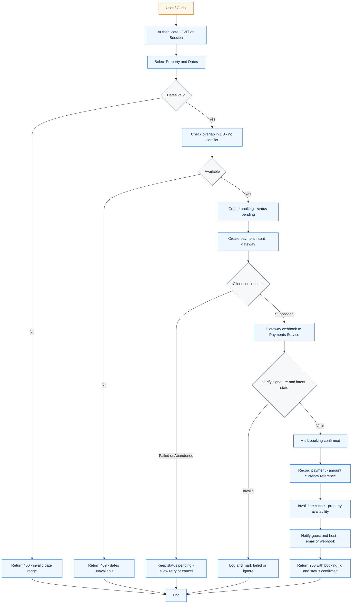

# Flowchart — Property Booking & Payment

This chart maps the core backend workflow from “Select Dates” → “Confirmed Booking”, including payment intent and webhook confirmation.

```mermaid
flowchart TD
  %% Styles
  classDef step fill:#eef6ff,stroke:#0969da,color:#0a3069,stroke-width:1px;
  classDef io fill:#fff7e6,stroke:#d97706,color:#7c2d12,stroke-width:1px;
  classDef dec fill:#f6f8fa,stroke:#57606a,color:#24292f,stroke-width:1px;

  %% Nodes
  U["User / Guest"]:::io
  A["Authenticate - JWT or Session"]:::step
  B["Select Property and Dates"]:::step
  C{"Dates valid"}:::dec
  C1["Return 400 - invalid date range"]:::step
  D["Check overlap in DB - no conflict"]:::step
  E{"Available"}:::dec
  E1["Return 409 - dates unavailable"]:::step
  F["Create booking - status pending"]:::step
  G["Create payment intent - gateway"]:::step
  H{"Client confirmation"}:::dec
  H1["Keep status pending - allow retry or cancel"]:::step
  I["Gateway webhook to Payments Service"]:::step
  J{"Verify signature and intent state"}:::dec
  J1["Log and mark failed or ignore"]:::step
  K["Mark booking confirmed"]:::step
  L["Record payment - amount currency reference"]:::step
  M["Invalidate cache - property availability"]:::step
  N["Notify guest and host - email or webhook"]:::step
  O["Return 200 with booking_id and status confirmed"]:::step
  Z["End"]:::step

  %% Edges
  U --> A
  A --> B
  B --> C
  C -- "No" --> C1 --> Z
  C -- "Yes" --> D
  D --> E
  E -- "No" --> E1 --> Z
  E -- "Yes" --> F
  F --> G
  G --> H
  H -- "Failed or Abandoned" --> H1 --> Z
  H -- "Succeeded" --> I
  I --> J
  J -- "Invalid" --> J1 --> Z
  J -- "Valid" --> K
  K --> L
  L --> M
  M --> N
  N --> O --> Z

```
