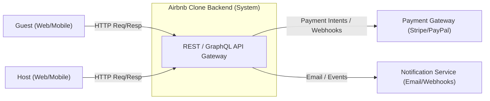

# Airbnb Clone — Data Flow Diagram (DFD)

**Repository:** `alx-airbnb-project-documentation`  
**Directory:** `data-flow-diagram/`  
**Deliverables:**  
- `README.md` (this file)  
- `data-flow.png` (Draw.io / diagrams.net export)

## 1) Purpose & Scope
Visualize **how data moves** through the backend for core operations: auth, listings, bookings, payments, and reviews.  
Covers inputs (requests), processes (API/services), data stores (DB/cache), and outputs (responses/notifications).

---

## 2) DFD Notation (used here)
- **External Entities:** users, payment gateway, email service  
- **Processes:** rounded nodes (Auth API, Booking Service, etc.)  
- **Data Stores:** cylinders (PostgreSQL tables / Redis)  
- **Data Flows:** directed arrows labeled with payloads

> The Mermaid diagrams below approximate a DFD for quick GitHub preview.  
> **Your official submission is the Draw.io diagram exported as `data-flow.png`.**

---

## 3) Level-0 (Context Diagram)

