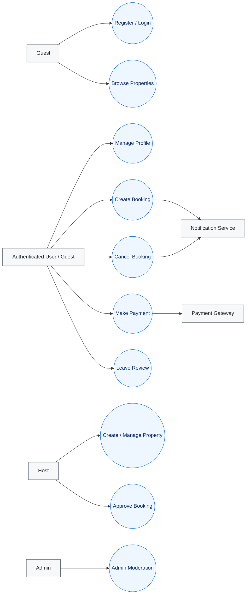

# Airbnb Clone — Use Case Diagram

**Repository:** `alx-airbnb-project-documentation`  
**Directory:** `use-case-diagram/`  
**Deliverables:**  
- `README.md` (this file)  
- `use-case-diagram.png` (Draw.io export)

## 1) Purpose
Visualize how key actors interact with the backend system across the main capabilities: authentication, listings, bookings, payments, and reviews.

---

## 2) Actors
- **Guest** — Unauthenticated user browsing and registering
- **Authenticated User (Guest)** — Book, pay, review, manage profile
- **Host** — Create and manage listings, approve/cancel bookings (if required)
- **Admin** — Moderate content, oversee users/system
- **Payment Gateway (External)** — Stripe/PayPal integration
- **Notification Service (External)** — Emails/webhooks for confirmations

---

## 3) Primary Use Cases
- **User Registration & Login** (Auth)
- **Profile Management** (Auth)
- **Browse/Search Properties** (Listings)
- **Create/Manage Property** (Host)
- **Upload Property Images** (Host)
- **Manage Availability** (Host)
- **Create Booking / Cancel Booking** (Bookings)
- **Host Approves Booking** *(optional)* (Bookings)
- **Make Payment / Refund** (Payments)
- **View Booking History** (Bookings)
- **Leave Review** (Reviews)
- **Admin Moderation** (Admin)

---

## 4) Mermaid Diagram 

> Note: Mermaid doesn’t have a native “use-case” shape, so I approximate with circles for use cases and styled boxes for actors/domains.

